<p align="center">
  <a href="https://v2.nonebot.dev/"></a>
</p>


<h1 align="center">nonebot-plugin-valve-server-query</h1>

_✨ NoneBot查服插件，可用于查询V社的游戏服务器，支持不同服组的权限配置以及服务器信息在线更新✨_

<p align="center">
  <a href="https://raw.githubusercontent.com/cscs181/QQ-Github-Bot/master/LICENSE">
    
  </a>
  <a href="https://pypi.python.org/pypi/nonebot-plugin-analysis-bilibili">
    
  </a>
  
</p>


## 安装

### nb-cli

```shell
待更新
```

### pip

```shell
待更新
```

### git

```shell
待更新
```

## 配置

### 权限配置

用于服务器信息更新相关命令，文件位于data/valve/authority.json，key为组名，value为拥有该组权限的QQ号列表

示例

```json
{
    "测试": [
        "123456789",
        "987654321"
    ],
    "test": [
        "11111111"
    ]
}
```

### 服务器信息批量添加配置

只需将json文件发送给机器人即可

示例

```json
{
    "组名": [
        {
            "id": 1,
            "ip": "127.0.0.1:25535"
        },
        {
            "id": 2,
            "ip": "127.0.0.1:25536"
        }
    ],
    "测试": [
        {
            "id": 1,
            "ip": "127.0.0.1:25535"
        }
    ]
}
```


## 使用

| 指令    | 权限         | 相关参数                                                     |
| ------- | ------------ | ------------------------------------------------------------ |
| a2s添加 | 详见权限配置 | 若用户仅一个组有权限，需要提供：id ip port，若用户有多个组的权限需要提供：组名 id ip port |
| a2s更新 | 详见权限配置 | 若用户仅一个组有权限，需要提供：id ip port，若用户有多个组的权限需要提供：组名 id ip port |
| a2s删除 | 详见权限配置 | 若用户仅一个组有权限，需要提供：id ，若用户有多个组的权限需要提供：组名 id |
| a2s列表 | 无           | 需要提供：组名，返回该组收录的所有ip:port                    |
| connect | 无           | 需要提供：ip:port，返回服务器信息                            |
| 组名    | 无           | 不加参数返回该组所有服务器信息，加id返回该服信息             |

## 示例

### 查组

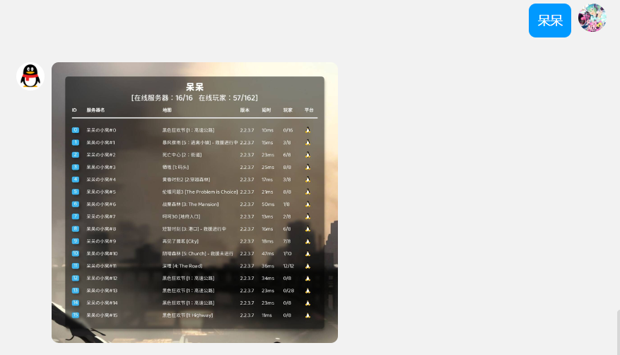</img>

### 查服

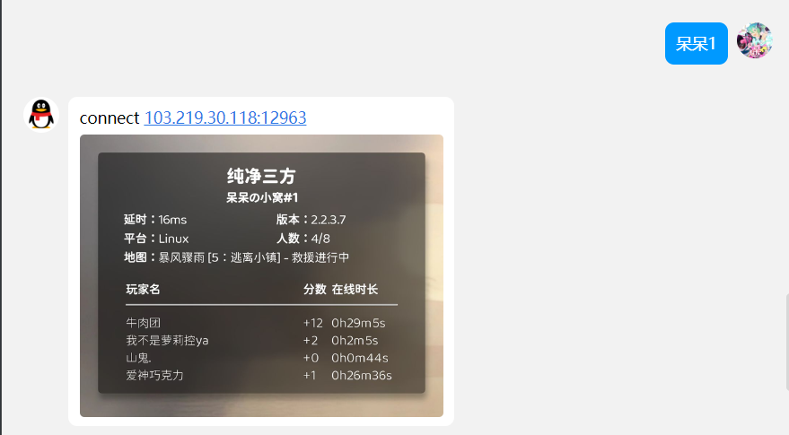</img>

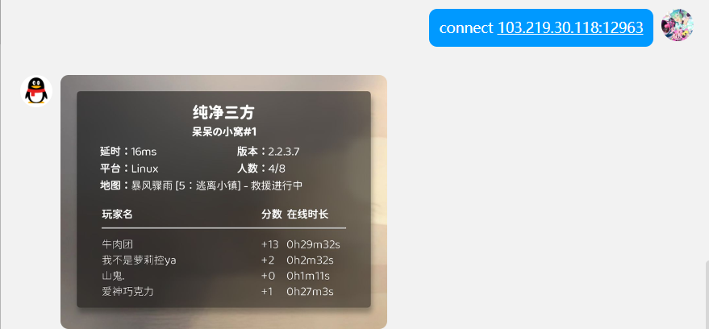</img>

### json快捷更新

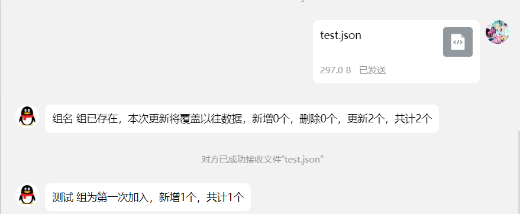</img>

### 服务器添加

对多个组都有权限时

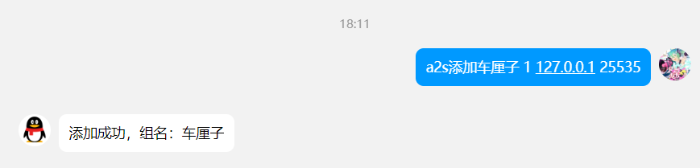</img>

仅对一个组有权限时

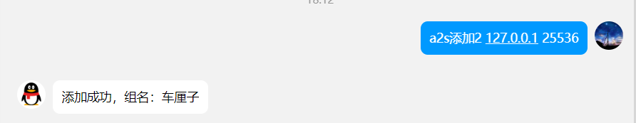</img>

### 服务器更新

对多个组都有权限时

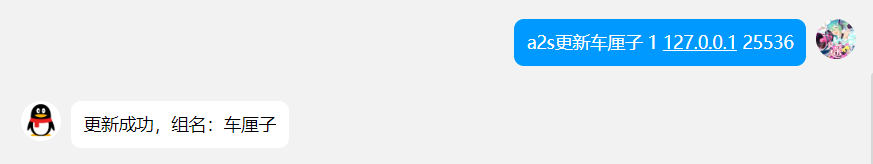</img>

仅对一个组有权限时

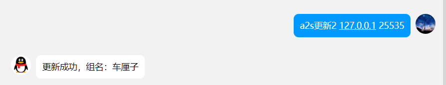</img>

### 服务器删除

对多个组都有权限时

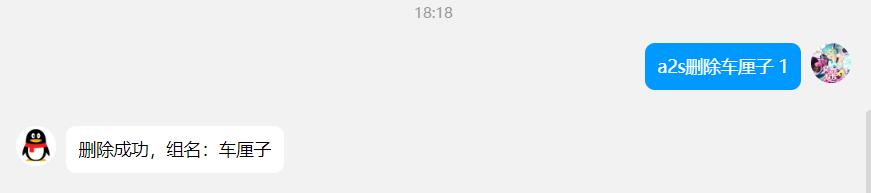</img>

仅对一个组有权限时

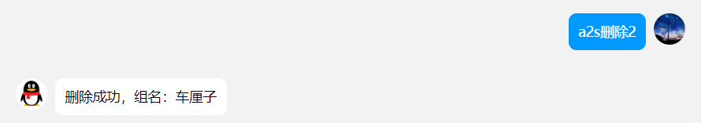</img>

### 服务器ip列表

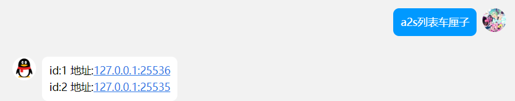</img>